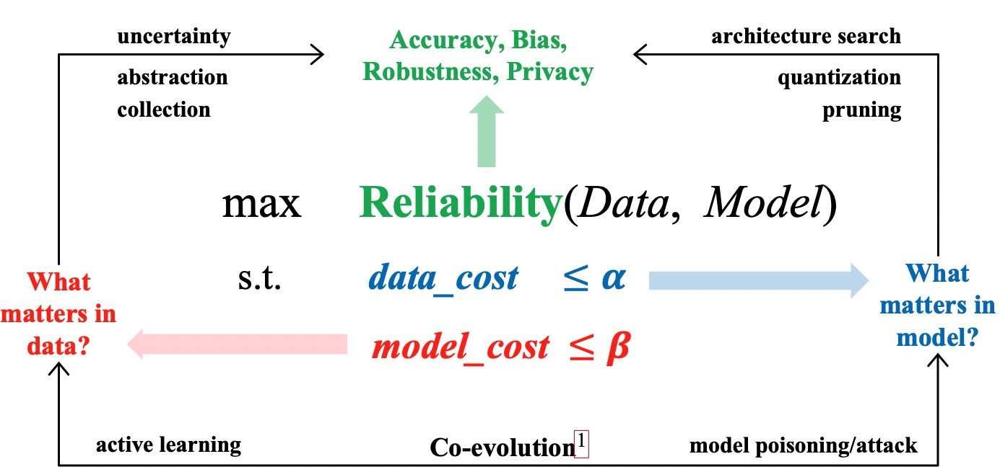



I am a final-year Ph.D. student in [Kahlert School of Computing](https://www.cs.utah.edu/) at the [University of Utah](https://www.utah.edu). I'm now doing research on machine learning and computer vision, under the supervision of [Prof. Shandian Zhe](https://www.cs.utah.edu/~zhe) and [Prof. Srikumar Ramalingam](https://users.cs.utah.edu/~srikumar/). 

My research  interests lie in the intersection of Deep Learning and Optimization and focus on reliable and economical AI techniques for large-scale AI models in real-world scenarios. Specifically, I'm exploring efficient computation, economic data abstraction and collection, and bias reduction and robustness enhancement in AI systems. Drawing upon my expertise in combinatorial optimization, Bayesian machine learning, and deep neural network expressiveness, I aim to address these multifaceted challenges in computer vision and physical simulation applications. This interdisciplinary approach allows me to forge new pathways in creating more efficient, equitable, and powerful AI technologies.

<!---   --->

<figure>

<figcaption>Research Roadmap</figcaption>
</figure>  
News
=====
\[12/2023\]: Our paper [Streaming Factor Trajectory Learning for Temporal Tensor Decomposition](https://neurips.cc/virtual/2023/poster/71689) will be presented on NeurIPS 2023. \
[05/2023]: Our paper [Getting away with more network pruning: From sparsity to geometry and linear regions](https://arxiv.org/pdf/2301.07966.pdf) will be presented on CPAIOR 2023. \
[11/2022]: Our papers [Batch Multi-Fidelity Active Learning with Budget Constraints]() and [Recall Distortion in Neural Network Pruning and the Undecayed Pruning Algorithm](https://proceedings.neurips.cc/paper_files/paper/2022/file/d3303e0ca98a267164d905bbc7947f88-Paper-Conference.pdf) are presented on NeurIPS 2022. \
07/2022: Our paper [The Combinatorial Brain Surgeon: Pruning Weights That Cancel One Another in Neural Networks](https://proceedings.mlr.press/v162/yu22f/yu22f.pdf) wil be presented on ICML 2022. \
12/2021: Our paper [Joint 3D Human Shape Recovery and Pose Estimation from a Single Image with Bilayer Graph](https://arxiv.org/pdf/2110.08472.pdf) wil be presented on 3DV 2021. \
12/2021: Our paper [Scaling Up Exact Neural Network Compression by ReLU Stability](https://proceedings.neurips.cc/paper/2021/file/e35d7a5768c4b85b4780384d55dc3620-Paper.pdf) wil be presented to NeurIPS 2021. \
11/2020: Our paper [Mapping of Sparse 3D Data using Alternating Projection](https://openaccess.thecvf.com/content/ACCV2020/papers/Ranade_Mapping_of_Sparse_3D_Data_using_Alternating_Projection_ACCV_2020_paper.pdf) wil be presented on ACCV 2020. \
10/2018: Our paper [VLASE: Vehicle localization by aggregating semantic edges](https://www.researchgate.net/publication/326290402_VLASE_Vehicle_Localization_by_Aggregating_Semantic_Edges) wil be presented on IROS 2018. \
06/2018: Our paper [Learning strict identity mappings in deep residual networks](https://openaccess.thecvf.com/content_cvpr_2018/papers/Yu_Learning_Strict_Identity_CVPR_2018_paper.pdf) wil be presented on CVPR 2018. 
<!--- 08/2017: One paper on 'Compass: Spatio temporal sentiment analysis of US election what twitter says!' is presented on KDD 2017 --->

Education
======
* Ph.D. in Computer Science, University of Utah, 2018 - Now
* Master in Computer Science, University of Utah, 2016 - 2018

Publications
======
  <ul>
    
  </ul>

<!---
Talks
======
  <ul>
    
  </ul>
  
--->

Teaching
======
  <ul>
    
  </ul>
  
Service and leadership
======
* Conference REviewer: ICLR 2024, ICML 2023, NeurIPS 2023, NeurIPS 2022, IROS 2021, ICVGIP 2021
* Program Committee: ICDM Workshop 2023
